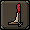

# Demonic Larva Tracker

Features for demonic larva at the boss Doom of Mokhaiotl.

### Features

* Death prediction
    * Immediately hide larva that are predicted to die
* Basic highlighting for outline, tile, and hull
    * Highlighting is hidden when a larva is predicted to die
* Recolor menu entries for larva names for easy identification
* Hide overheads for melee, range, and magic demonic larva
* Remove ugly spawn animation

### Contribution

Accepting feature and pull requests.

### Attribution

Inspired by the [Tzhaar Hp Tracker](https://github.com/MoreBuchus/buchus-plugins/tree/tzhaar-hp-tracker) plugin.