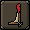

# Demonic Larva Tracker

Features for demonic larva at the boss Doom of Mokhaiotl.

### Features

* Death prediction
    * Immediately hide larva that are predicted to die
* Highlight tile, outline, hull, and clickbox
    * Highlights are hidden when a larva is predicted to die
* Hide overheads
* Recolor menu entries
* Absorbed larva infobox
* Draw names above npcs
* Remove spawn animation
* Expand loot interface

### Contribution

Create an issue before submitting a pull request.

### Attribution

Inspired by the [Tzhaar Hp Tracker](https://github.com/MoreBuchus/buchus-plugins/tree/tzhaar-hp-tracker) plugin.